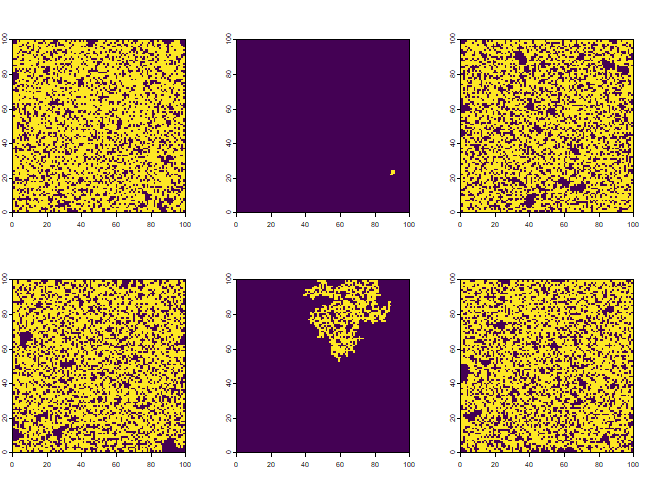

<!-- README.md is generated from README.Rmd. Please edit that file -->

# RCAFE

<!-- badges: start -->
<!-- badges: end -->

An R package to (possibly) resurrect (some of) the CAFE (Cellular
Analysis of Fire and Extinction) simulation model that was used for a
series of studies by Ross Bradstock and colleagues in the 1990s,
investigating plant population dynamics in relation to various wildfire
regimes.

## Installation

You can install the development version of RCAFE from
[GitHub](https://github.com/) with:

``` r
# install.packages("devtools")
devtools::install_github("mbedward/RCAFE")
```

To install on a Windows system you will need to have
[Rtools](https://cran.r-project.org/bin/windows/Rtools/) installed to
build the C++ functions in the package.

## Examples

Note: this example code is a bit quick and dirty as the package is still
in its early days!

``` r

library(RCAFE)
library(terra)
#> terra 1.7.78
library(progress)

# Create a matrix of constant time since fire values (implicitly treated as
# years). The matrix dimensions will also define the simulation landscape.
sidelen <- 100

tsf <- matrix(20L, sidelen, sidelen)

# Define two fire regimes: annual prescribed fire and wildfire

##### Prescribed fire: attempt to burn 10% of the landscape each year
pb <- make_regime_prescribed(
  name = "pb", 
  fn_prob_tsf = function(tsf) { 1 / (1 + exp(1 - 0.6*tsf)) }, 
  fn_occur = function(time) { time > 0 }, 
  prop_landscape = 0.1, 
  replace = TRUE)

##### Wildfire: attempted ignition every 3 years on average
wf <- make_regime_wildfire(
  name = "wf", 
  fn_prob_tsf = function(tsf) { 1 / (1 + exp(3 - 0.8*tsf)) }, 
  fn_occur = function(time) { runif(1) < 1/3 } )

# Run the simulation for 10 replicates of 200 years with a 100 year adaptation
# period in which only wildfires occur (to evolve some spatial structure in the
# pattern of time since fire). 
#
# This will take several minutes
#
rcafe_simulate(DB_path = "test_run.duckdb", 
               tsf_init = tsf, 
               regimes = list(pb, wf), 
               n_rep = 1, 
               n_iter = 200, 
               n_burnin = 100, 
               map_fire_types = "all")
               
```

Simulation results are written to an output DuckDB database.

``` r

db <- DBI::dbConnect(duckdb::duckdb("test_run.duckdb"))

DBI::dbListTables(db)
#> [1] "firemaps"       "fires"          "regimes"        "simulation"    
#> [5] "tsf_proportion"
```

The regimes table presently stores just the name and type (1=wildfire,
2=prescribed fire) of each regime.

``` r

DBI::dbGetQuery(db, "select * from regimes;")
#>   id regime_type name
#> 1  1           2   pb
#> 2  2           1   wf
```

The fires table stores the time, type and extent of each fire.

``` r

DBI::dbGetQuery(db, "select f.rep, f.time, r.name as regime_name, f.size 
                from fires f join regimes r on f.regime_id = r.id 
                limit 10;")
#>    rep time regime_name size
#> 1    1    1          pb 1000
#> 2    1    2          pb 1000
#> 3    1    2          wf 7325
#> 4    1    3          pb 1000
#> 5    1    4          pb 1000
#> 6    1    4          wf    6
#> 7    1    5          pb 1000
#> 8    1    6          pb 1000
#> 9    1    7          pb 1000
#> 10   1    8          pb 1000
```

The firemaps table stores the paths to raster fire maps. The maps are
stored in GeoTIFF files, with one file for each simulation replicate X
fire regime. Fires are stored as separate layers in each file (one fire
per simulation year) with layer names of the form: time000001,
time000005 etc.

``` r

DBI::dbGetQuery(db, "select * from firemaps where rep=1;")
#>   rep regime_id            raster_path
#> 1   1         1 test_run_pb_000001.tif
#> 2   1         2 test_run_wf_000001.tif
```

``` r

library(terra)

dat <- DBI::dbGetQuery(db, "select raster_path from firemaps where rep=1 and regime_id=2;")

r_wf <- rast(dat$raster_path)

dat_levels <- data.frame(id = 0:1, state = c("unburnt", "burnt"))
levels(r_wf) <- lapply(1:nlyr(r_wf), function(...) dat_levels)
```

View a few fire maps…

``` r

par(mfrow = c(2, 3))

plot(r_wf, 1:6, main="", legend = FALSE)
```


