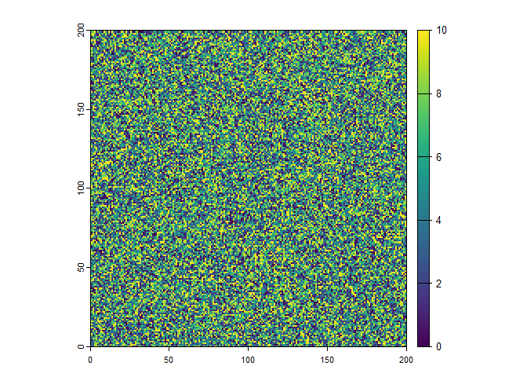
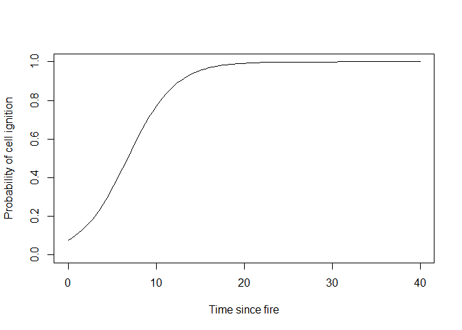
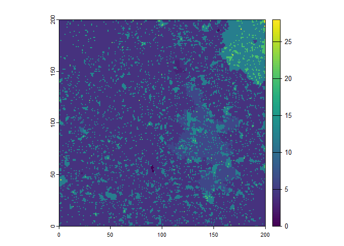
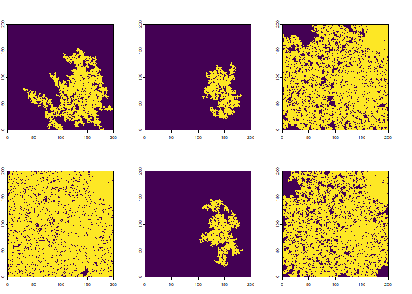
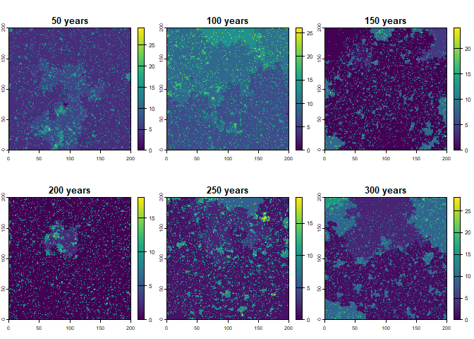

<!-- README.md is generated from README.Rmd. Please edit that file -->

# RCAFE

<!-- badges: start -->
<!-- badges: end -->

An R package to (possibly) resurrect (some of) the CAFE (Cellular
Analysis of Fire and Extinction) simulation model that was used for a
series of studies by Ross Bradstock and colleagues in the 1990s,
investigating plant population dynamics in relation to various wildfire
regimes.

## Installation

You can install the development version of RCAFE from
[GitHub](https://github.com/) with:

``` r
# install.packages("devtools")
devtools::install_github("mbedward/RCAFE")
```

To install on a Windows system you will need to have
[Rtools](https://cran.r-project.org/bin/windows/Rtools/) installed to
build the C++ functions in the package.

## Examples

``` r
library(RCAFE)
library(terra)
#> terra 1.7.78
```

``` r
library(progress)

# Create a matrix of random time since fire values (implicitly treated as years).
# The matrix dimensions will also define the simulation landscape.
sidelen <- 200
MinTSF <- 0
MaxTSF <- 10

tsf <- matrix(as.integer(sample(MinTSF:MaxTSF, size = sidelen*sidelen, replace = TRUE)), 
              sidelen, sidelen)

plot(rast(tsf))
```



``` r

# A function to relate the probability of fire in a cell to the
# time since fire
fn_prob <- function(tsf) {
  1 / (1 + exp(2.5 - 0.37*tsf))
}

curve(fn_prob(x), from = 0, to = 40, ylim = c(0, 1), 
      xlab = "Time since fire", ylab = "Probability of cell ignition")
```



``` r


# Simulate fires for an intial period to evolve spatial structure in the 
# pattern of time since fire
Nburn_in <- 400
pb <- progress_bar$new(total = Nburn_in)

for (i in 1:Nburn_in) {
  pb$tick()

  res <- RCAFE:::doFire(tsf, fn_prob)

  # Update the TSF matrix based on the fire map returned by
  # the doFire function
  tsf <- tsf + 1
  tsf[res$landscape > 0] <- 0  # Burnt cells
}

#> 100%[=======================================================================]
#> 100%
```

``` r

# View the resulting TSF pattern
plot(rast(tsf))
```



``` r

# Simulate a few more fires and plot them to get some idea of
# the general patterns. We will only plot fires that burnt at least
# 5% of the landscape.
min_landscape_prop <- 0.05

Nfires <- 6
rr <- lapply(1:Nfires, function(...) {
  tsfx <- tsf
  while (TRUE) {
    res <- RCAFE:::doFire(tsf = tsfx, fn_prob)

    tsfx <- tsfx + 1
    tsfx[res$landscape > 0] <- 0

    if (res$ncells > sidelen*sidelen*min_landscape_prop) break
  }
  rast(res$landscape)
})

rr <- rast(rr)
plot(rr, legend = FALSE, main = "")
```



``` r


# Run the simulation function for a set of 50 year batches and view the
# time since fire pattern at the end of each batch
#
Nbatches <- 6
Nyears <- 50

rr <- lapply(1:Nbatches, function(i) {
  tsf <<- RCAFE:::cafeSim(initial_tsf = tsf, n_times = Nyears, fn_prob_tsf = fn_prob)
  rast(tsf)
})

rr <- rast(rr)
names(rr) <- sprintf("%d years", seq_len(Nbatches) * Nyears)
plot(rr)
```


